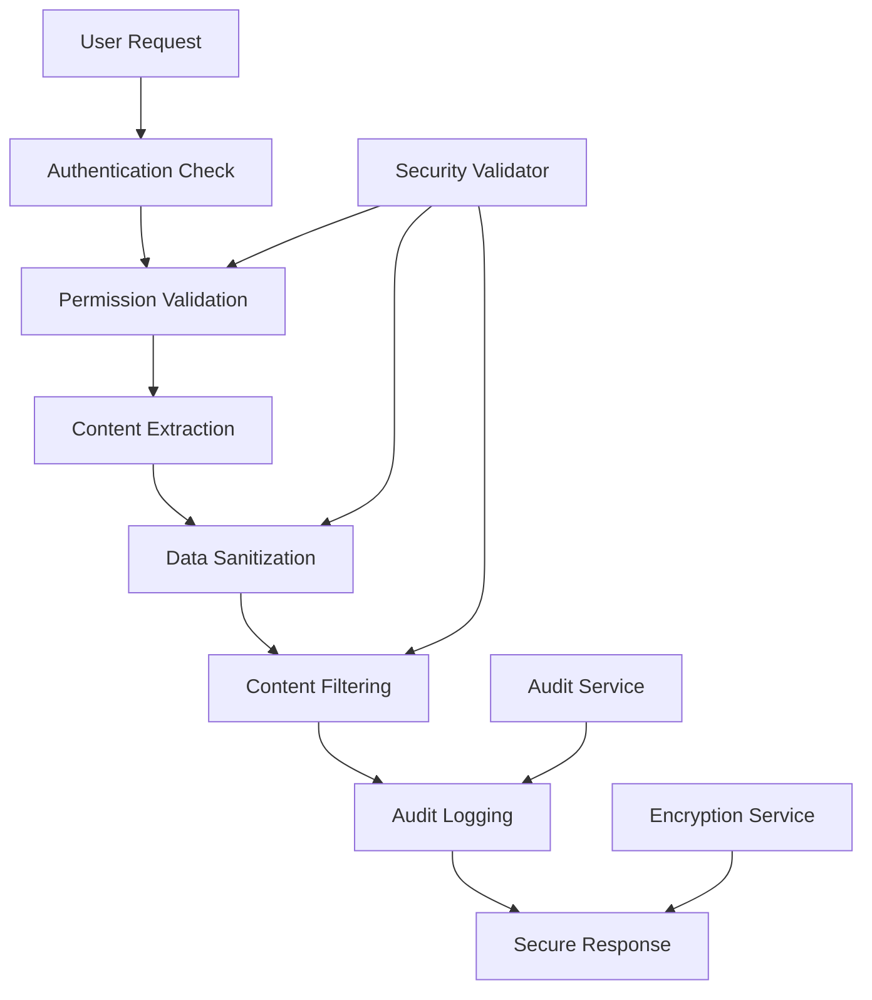

# Security Considerations and Best Practices

## Overview

This document outlines security considerations, best practices, and implementation guidelines for the Contextual Dashboard Chat feature in OpenSearch Dashboards. Security is paramount when extracting and processing dashboard content that may contain sensitive data.

## Security Architecture

### Defense in Depth

The contextual chat feature implements multiple layers of security:

1. **Authentication Layer**: User identity verification
2. **Authorization Layer**: Permission-based access control
3. **Data Validation Layer**: Input sanitization and validation
4. **Content Filtering Layer**: Sensitive data detection and masking
5. **Audit Layer**: Comprehensive logging and monitoring
6. **Transport Layer**: Secure data transmission

### Security Boundaries



## Authentication and Authorization

### User Authentication

The contextual chat feature integrates with OpenSearch Dashboards' existing authentication mechanisms:

```typescript
interface SecurityContext {
  user: AuthenticatedUser;
  roles: string[];
  permissions: Permission[];
  tenant?: string;
}

class ContextSecurityValidator {
  async validateUserAccess(
    user: AuthenticatedUser, 
    context: UIContext
  ): Promise<UIContext> {
    // Verify user authentication
    if (!this.isAuthenticated(user)) {
      throw new SecurityError('User not authenticated');
    }
    
    // Check session validity
    if (!this.isSessionValid(user.sessionId)) {
      throw new SecurityError('Session expired');
    }
    
    return this.filterContextByPermissions(user, context);
  }
}
```

### Permission-Based Access Control

Content extraction respects existing OpenSearch Dashboard permissions:

```typescript
class PermissionValidator {
  async validateContentAccess(
    user: AuthenticatedUser,
    content: ContentElement
  ): Promise<boolean> {
    // Check dashboard access permissions
    if (!await this.canAccessDashboard(user, content.dashboardId)) {
      return false;
    }
    
    // Check index permissions for data content
    if (content.type === ContentType.VISUALIZATION || 
        content.type === ContentType.DATA_TABLE) {
      return this.canAccessIndex(user, content.metadata.indexPattern);
    }
    
    // Check saved object permissions
    if (content.metadata.savedObjectId) {
      return this.canAccessSavedObject(user, content.metadata.savedObjectId);
    }
    
    return true;
  }
  
  private async canAccessIndex(
    user: AuthenticatedUser, 
    indexPattern: string
  ): Promise<boolean> {
    const permissions = await this.getUserPermissions(user);
    return permissions.indices.some(permission => 
      this.matchesPattern(indexPattern, permission.names) &&
      permission.privileges.includes('read')
    );
  }
}
```

### Role-Based Content Filtering

Different user roles have access to different content types:

```typescript
interface RoleBasedFilter {
  role: string;
  allowedContentTypes: ContentType[];
  deniedFields: string[];
  maxContextSize: number;
}

const ROLE_FILTERS: RoleBasedFilter[] = [
  {
    role: 'admin',
    allowedContentTypes: Object.values(ContentType),
    deniedFields: [],
    maxContextSize: 10485760 // 10MB
  },
  {
    role: 'analyst',
    allowedContentTypes: [
      ContentType.VISUALIZATION,
      ContentType.DATA_TABLE,
      ContentType.TEXT_PANEL
    ],
    deniedFields: ['sensitive_data', 'pii'],
    maxContextSize: 5242880 // 5MB
  },
  {
    role: 'viewer',
    allowedContentTypes: [
      ContentType.VISUALIZATION,
      ContentType.TEXT_PANEL
    ],
    deniedFields: ['sensitive_data', 'pii', 'raw_data'],
    maxContextSize: 1048576 // 1MB
  }
];
```

## Data Protection

### Sensitive Data Detection

Implement automatic detection of sensitive data patterns:

```typescript
class SensitiveDataDetector {
  private sensitivePatterns = [
    // Personal Identifiable Information
    /\b\d{3}-\d{2}-\d{4}\b/g,           // SSN
    /\b\d{4}[\s-]?\d{4}[\s-]?\d{4}[\s-]?\d{4}\b/g, // Credit Card
    /\b[A-Za-z0-9._%+-]+@[A-Za-z0-9.-]+\.[A-Z|a-z]{2,}\b/g, // Email
    /\b\d{3}[-.]?\d{3}[-.]?\d{4}\b/g,   // Phone Number
    
    // Financial Information
    /\b(?:IBAN|iban)\s*:?\s*[A-Z]{2}\d{2}[A-Z0-9]{4}\d{7}[A-Z0-9]{1,16}\b/g,
    /\b(?:routing|aba)\s*:?\s*\d{9}\b/gi,
    
    // Authentication Tokens
    /\b[A-Za-z0-9]{32,}\b/g,            // API Keys (32+ chars)
    /bearer\s+[A-Za-z0-9\-._~+/]+=*/gi, // Bearer tokens
    /\bpassword\s*[:=]\s*\S+/gi,        // Passwords
    
    // Healthcare Information
    /\b\d{3}-\d{2}-\d{4}\b/g,           // Medical Record Numbers
    /\b[A-Z]{1,2}\d{2,3}[A-Z]?\d{2}[A-Z]?\b/g // ICD codes
  ];
  
  detectSensitiveData(text: string): SensitiveDataMatch[] {
    const matches: SensitiveDataMatch[] = [];
    
    this.sensitivePatterns.forEach((pattern, index) => {
      const patternMatches = Array.from(text.matchAll(pattern));
      patternMatches.forEach(match => {
        matches.push({
          type: this.getPatternType(index),
          value: match[0],
          position: match.index || 0,
          confidence: this.calculateConfidence(match[0], index)
        });
      });
    });
    
    return matches;
  }
  
  private getPatternType(patternIndex: number): SensitiveDataType {
    const types = [
      'SSN', 'CREDIT_CARD', 'EMAIL', 'PHONE',
      'IBAN', 'ROUTING_NUMBER', 'API_KEY', 
      'BEARER_TOKEN', 'PASSWORD', 'MEDICAL_RECORD', 'ICD_CODE'
    ];
    return types[patternIndex] as SensitiveDataType;
  }
}
```

### Data Sanitization

Implement comprehensive data sanitization:

```typescript
class DataSanitizer {
  sanitizeContent(content: ContentElement): ContentElement {
    const sanitizedContent = { ...content };
    
    // Sanitize text content
    if (content.data.textContent) {
      sanitizedContent.data.textContent = this.sanitizeTextContent(
        content.data.textContent
      );
    }
    
    // Sanitize table data
    if (content.data.tableData) {
      sanitizedContent.data.tableData = this.sanitizeTableData(
        content.data.tableData
      );
    }
    
    // Sanitize chart data
    if (content.data.chartData) {
      sanitizedContent.data.chartData = this.sanitizeChartData(
        content.data.chartData
      );
    }
    
    // Remove raw data if configured
    if (this.shouldRemoveRawData(content)) {
      delete sanitizedContent.data.rawData;
    }
    
    return sanitizedContent;
  }
  
  private sanitizeTextContent(textContent: TextContent): TextContent {
    const sensitiveMatches = this.sensitiveDataDetector.detectSensitiveData(
      textContent.plainText
    );
    
    let sanitizedText = textContent.plainText;
    
    // Replace sensitive data with masked values
    sensitiveMatches.forEach(match => {
      const maskedValue = this.maskSensitiveValue(match);
      sanitizedText = sanitizedText.replace(match.value, maskedValue);
    });
    
    return {
      ...textContent,
      plainText: sanitizedText,
      formattedText: textContent.formattedText ? 
        this.sanitizeFormattedText(textContent.formattedText) : undefined
    };
  }
  
  private sanitizeTableData(tableData: TableData): TableData {
    const sensitiveColumns = this.identifySensitiveColumns(tableData.headers);
    
    const sanitizedRows = tableData.rows.map(row => 
      row.map((cell, columnIndex) => {
        if (sensitiveColumns.includes(columnIndex)) {
          return this.maskTableCell(cell, tableData.headers[columnIndex]);
        }
        return this.sanitizeCellContent(cell);
      })
    );
    
    return {
      ...tableData,
      rows: sanitizedRows
    };
  }
  
  private maskSensitiveValue(match: SensitiveDataMatch): string {
    switch (match.type) {
      case 'SSN':
        return 'XXX-XX-' + match.value.slice(-4);
      case 'CREDIT_CARD':
        return '**** **** **** ' + match.value.slice(-4);
      case 'EMAIL':
        const [local, domain] = match.value.split('@');
        return local.charAt(0) + '***@' + domain;
      case 'PHONE':
        return '***-***-' + match.value.slice(-4);
      case 'API_KEY':
      case 'BEARER_TOKEN':
      case 'PASSWORD':
        return '[REDACTED]';
      default:
        return '[MASKED]';
    }
  }
}
```

### Field-Level Security

Implement field-level security for granular control:

```typescript
interface FieldSecurityRule {
  fieldPattern: string;
  action: 'allow' | 'deny' | 'mask' | 'redact';
  roles?: string[];
  conditions?: SecurityCondition[];
}

class FieldSecurityManager {
  private rules: FieldSecurityRule[] = [
    {
      fieldPattern: '*password*',
      action: 'redact',
      roles: ['*']
    },
    {
      fieldPattern: '*email*',
      action: 'mask',
      roles: ['viewer', 'analyst']
    },
    {
      fieldPattern: 'sensitive_*',
      action: 'deny',
      roles: ['viewer']
    },
    {
      fieldPattern: 'admin_*',
      action: 'allow',
      roles: ['admin']
    }
  ];
  
  applyFieldSecurity(
    data: any, 
    userRoles: string[]
  ): any {
    return this.processObject(data, userRoles, '');
  }
  
  private processObject(
    obj: any, 
    userRoles: string[], 
    path: string
  ): any {
    if (typeof obj !== 'object' || obj === null) {
      return obj;
    }
    
    const result: any = Array.isArray(obj) ? [] : {};
    
    for (const [key, value] of Object.entries(obj)) {
      const fieldPath = path ? `${path}.${key}` : key;
      const action = this.getFieldAction(fieldPath, userRoles);
      
      switch (action) {
        case 'deny':
          // Skip this field entirely
          continue;
        case 'redact':
          result[key] = '[REDACTED]';
          break;
        case 'mask':
          result[key] = this.maskValue(value);
          break;
        case 'allow':
        default:
          result[key] = this.processObject(value, userRoles, fieldPath);
          break;
      }
    }
    
    return result;
  }
}
```

## Secure Communication

### Data Transmission Security

Ensure secure transmission of contextual data:

```typescript
class SecureTransmissionManager {
  async transmitContext(
    context: UIContext,
    destination: string
  ): Promise<void> {
    // Encrypt sensitive data
    const encryptedContext = await this.encryptContext(context);
    
    // Add integrity check
    const checksum = await this.calculateChecksum(encryptedContext);
    
    // Secure transmission
    await this.secureTransmit({
      data: encryptedContext,
      checksum: checksum,
      timestamp: Date.now(),
      destination: destination
    });
  }
  
  private async encryptContext(context: UIContext): Promise<EncryptedContext> {
    // Use AES-256-GCM for encryption
    const key = await this.getEncryptionKey();
    const iv = crypto.getRandomValues(new Uint8Array(12));
    
    const encoder = new TextEncoder();
    const data = encoder.encode(JSON.stringify(context));
    
    const encryptedData = await crypto.subtle.encrypt(
      { name: 'AES-GCM', iv: iv },
      key,
      data
    );
    
    return {
      data: Array.from(new Uint8Array(encryptedData)),
      iv: Array.from(iv),
      algorithm: 'AES-GCM'
    };
  }
}
```

### API Security

Secure all contextual chat API endpoints:

```typescript
class APISecurityMiddleware {
  async validateRequest(
    request: Request,
    response: Response,
    next: NextFunction
  ): Promise<void> {
    try {
      // Rate limiting
      await this.checkRateLimit(request);
      
      // Authentication
      const user = await this.authenticateUser(request);
      
      // Authorization
      await this.authorizeRequest(user, request);
      
      // Input validation
      await this.validateInput(request);
      
      // Add security headers
      this.addSecurityHeaders(response);
      
      next();
    } catch (error) {
      this.handleSecurityError(error, response);
    }
  }
  
  private async checkRateLimit(request: Request): Promise<void> {
    const clientId = this.getClientId(request);
    const currentRequests = await this.getRateLimitCount(clientId);
    
    if (currentRequests > this.getRateLimit(clientId)) {
      throw new SecurityError('Rate limit exceeded');
    }
    
    await this.incrementRateLimitCount(clientId);
  }
  
  private addSecurityHeaders(response: Response): void {
    response.setHeader('X-Content-Type-Options', 'nosniff');
    response.setHeader('X-Frame-Options', 'DENY');
    response.setHeader('X-XSS-Protection', '1; mode=block');
    response.setHeader('Strict-Transport-Security', 'max-age=31536000; includeSubDomains');
    response.setHeader('Content-Security-Policy', this.getCSPHeader());
  }
}
```

## Audit and Monitoring

### Comprehensive Audit Logging

Implement detailed audit logging for security events:

```typescript
class SecurityAuditLogger {
  async logContextAccess(event: ContextAccessEvent): Promise<void> {
    const auditEntry: AuditLogEntry = {
      timestamp: new Date().toISOString(),
      eventType: 'CONTEXT_ACCESS',
      userId: event.user.id,
      userRoles: event.user.roles,
      sessionId: event.sessionId,
      dashboardId: event.dashboardId,
      contentTypes: event.extractedContent.map(c => c.type),
      contentCount: event.extractedContent.length,
      dataSize: this.calculateDataSize(event.extractedContent),
      ipAddress: event.ipAddress,
      userAgent: event.userAgent,
      success: event.success,
      errorMessage: event.errorMessage,
      securityFlags: this.analyzeSecurityFlags(event)
    };
    
    await this.writeAuditLog(auditEntry);
    
    // Alert on suspicious activity
    if (this.isSuspiciousActivity(auditEntry)) {
      await this.triggerSecurityAlert(auditEntry);
    }
  }
  
  private analyzeSecurityFlags(event: ContextAccessEvent): SecurityFlag[] {
    const flags: SecurityFlag[] = [];
    
    // Check for unusual access patterns
    if (event.extractedContent.length > 50) {
      flags.push('LARGE_CONTEXT_EXTRACTION');
    }
    
    // Check for sensitive data access
    const hasSensitiveData = event.extractedContent.some(c => 
      this.containsSensitiveData(c)
    );
    if (hasSensitiveData) {
      flags.push('SENSITIVE_DATA_ACCESS');
    }
    
    // Check for off-hours access
    if (this.isOffHoursAccess(event.timestamp)) {
      flags.push('OFF_HOURS_ACCESS');
    }
    
    return flags;
  }
}
```

### Security Monitoring

Implement real-time security monitoring:

```typescript
class SecurityMonitor {
  private alertThresholds = {
    failedAuthAttempts: 5,
    unusualDataAccess: 10,
    rateLimitViolations: 3,
    sensitiveDataAccess: 1
  };
  
  async monitorSecurityEvents(): Promise<void> {
    // Monitor authentication failures
    this.monitorAuthenticationFailures();
    
    // Monitor unusual data access patterns
    this.monitorDataAccessPatterns();
    
    // Monitor rate limit violations
    this.monitorRateLimitViolations();
    
    // Monitor sensitive data access
    this.monitorSensitiveDataAccess();
  }
  
  private async monitorAuthenticationFailures(): Promise<void> {
    const recentFailures = await this.getRecentAuthFailures();
    
    // Group by IP address
    const failuresByIP = this.groupBy(recentFailures, 'ipAddress');
    
    for (const [ip, failures] of Object.entries(failuresByIP)) {
      if (failures.length >= this.alertThresholds.failedAuthAttempts) {
        await this.triggerAlert({
          type: 'AUTHENTICATION_FAILURE_THRESHOLD',
          severity: 'HIGH',
          details: {
            ipAddress: ip,
            failureCount: failures.length,
            timeWindow: '5 minutes'
          }
        });
        
        // Consider IP blocking
        await this.considerIPBlocking(ip, failures);
      }
    }
  }
  
  private async triggerAlert(alert: SecurityAlert): Promise<void> {
    // Log the alert
    await this.logSecurityAlert(alert);
    
    // Send notifications
    await this.sendAlertNotifications(alert);
    
    // Take automated actions if configured
    await this.executeAutomatedResponse(alert);
  }
}
```

## Security Configuration

### Security Configuration Schema

```yaml
# Security configuration for contextual chat
assistant:
  contextual_chat:
    security:
      # Authentication settings
      authentication:
        required: true
        session_timeout: 3600  # 1 hour
        multi_factor_required: false
        
      # Authorization settings
      authorization:
        respect_dashboard_permissions: true
        respect_index_permissions: true
        role_based_filtering: true
        
      # Data protection settings
      data_protection:
        sensitive_data_detection: true
        automatic_sanitization: true
        field_level_security: true
        encryption_at_rest: true
        encryption_in_transit: true
        
      # Content filtering
      content_filtering:
        enable_pii_detection: true
        enable_financial_data_detection: true
        enable_healthcare_data_detection: true
        custom_patterns: []
        
      # Audit and monitoring
      audit:
        enable_audit_logging: true
        log_all_access: true
        log_failed_attempts: true
        audit_retention_days: 90
        
      # Rate limiting
      rate_limiting:
        enabled: true
        requests_per_minute: 60
        burst_limit: 10
        
      # Security headers
      security_headers:
        enable_csp: true
        enable_hsts: true
        enable_xss_protection: true
        
      # Alerting
      alerting:
        enable_security_alerts: true
        alert_on_suspicious_activity: true
        alert_thresholds:
          failed_auth_attempts: 5
          unusual_data_access: 10
          sensitive_data_access: 1
```

## Security Best Practices

### Development Best Practices

1. **Secure by Default**: All security features enabled by default
2. **Principle of Least Privilege**: Grant minimum necessary permissions
3. **Defense in Depth**: Multiple layers of security controls
4. **Input Validation**: Validate all inputs at every boundary
5. **Output Encoding**: Properly encode all outputs
6. **Error Handling**: Don't leak sensitive information in errors

### Deployment Best Practices

1. **Security Testing**: Comprehensive security testing before deployment
2. **Vulnerability Scanning**: Regular vulnerability assessments
3. **Penetration Testing**: Periodic penetration testing
4. **Security Reviews**: Code security reviews for all changes
5. **Incident Response**: Prepared incident response procedures

### Operational Best Practices

1. **Regular Updates**: Keep all dependencies updated
2. **Security Monitoring**: Continuous security monitoring
3. **Access Reviews**: Regular access permission reviews
4. **Backup Security**: Secure backup and recovery procedures
5. **Training**: Regular security training for developers and operators

## Compliance Considerations

### Data Privacy Regulations

The contextual chat feature supports compliance with various data privacy regulations:

- **GDPR**: European General Data Protection Regulation
- **CCPA**: California Consumer Privacy Act
- **HIPAA**: Health Insurance Portability and Accountability Act
- **SOX**: Sarbanes-Oxley Act
- **PCI DSS**: Payment Card Industry Data Security Standard

### Compliance Features

```typescript
class ComplianceManager {
  async ensureCompliance(
    context: UIContext,
    regulation: ComplianceRegulation
  ): Promise<UIContext> {
    switch (regulation) {
      case 'GDPR':
        return this.applyGDPRCompliance(context);
      case 'HIPAA':
        return this.applyHIPAACompliance(context);
      case 'PCI_DSS':
        return this.applyPCIDSSCompliance(context);
      default:
        return this.applyGeneralCompliance(context);
    }
  }
  
  private async applyGDPRCompliance(context: UIContext): Promise<UIContext> {
    // Remove personal data unless explicitly consented
    const filteredContent = context.content.filter(content => 
      !this.containsPersonalData(content) || 
      this.hasUserConsent(content)
    );
    
    // Anonymize remaining data
    const anonymizedContent = await Promise.all(
      filteredContent.map(content => this.anonymizeContent(content))
    );
    
    return {
      ...context,
      content: anonymizedContent
    };
  }
}
```

This security guide provides comprehensive coverage of security considerations for the contextual dashboard chat feature. Follow these guidelines to ensure secure implementation and operation.